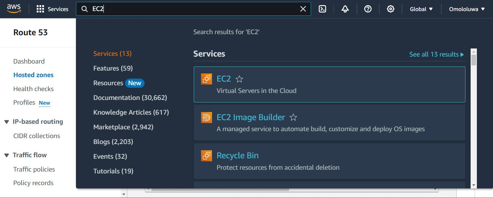
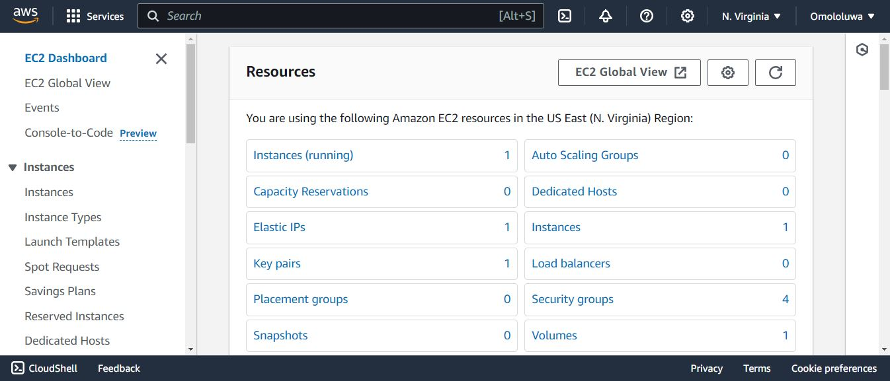
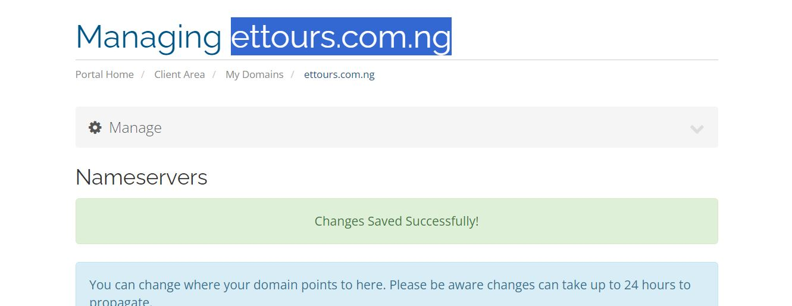
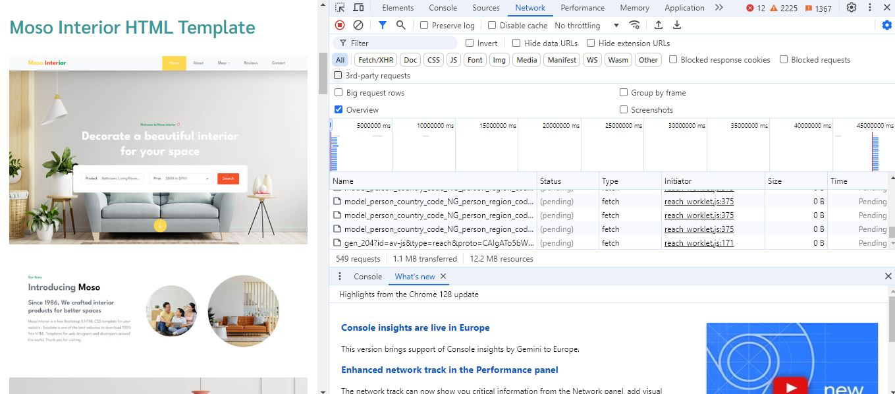
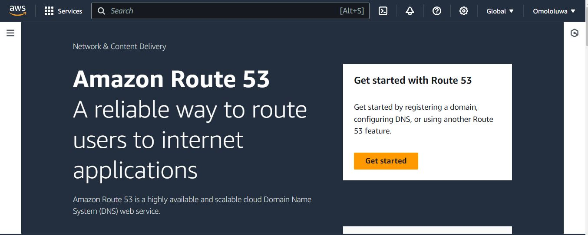
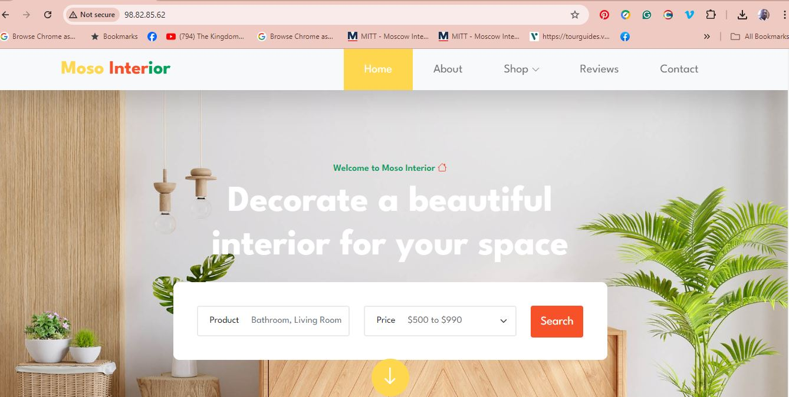

# Hello World My Name is Omololu David Aiyeola

Welcome to my world.

**Hello world**

- fist task

- second taskcle

1. He

2. Her

Welcome once again

**Hello World**

> [!NOTE]
> This explains things better.

## Documentation

### Create An Ubuntu Server

- Locate and click on **EC2** within the AWS management console.

This to lunching an EC2 instance on AWS.

- Click on **Launch Instance**

EC2 lunching succesfull.

This the registration of a domain name.

- Go back to your EC2 dashboard and copy your **Public IPv4 address**.

### Install Nginx and Setup Your Website

Visit your instances **Public IPv4 address** in a web browser to view the default Nginx startup page.

- Download your website template from your preferred website by navigating to the website, locating the template you want, and obtaining the download URL for the website.

- Download your website template from your preferred website by navigating to the website, locating the template you want, and obtaining the download URL for the website.

### Create An A Record

- Go back to your AWS console, search for **Route 53①**, and then choose **Route 53②** from the list of services shown.

> [!NOTE]
You may notice the sign that says **Not secure**. Next, you'll use certbot to obtain the SSL certificate necessary to enable HTTPS on your site.

- Visit **`https://<domain name>`** to view your website.

#### The End Of Project 1

